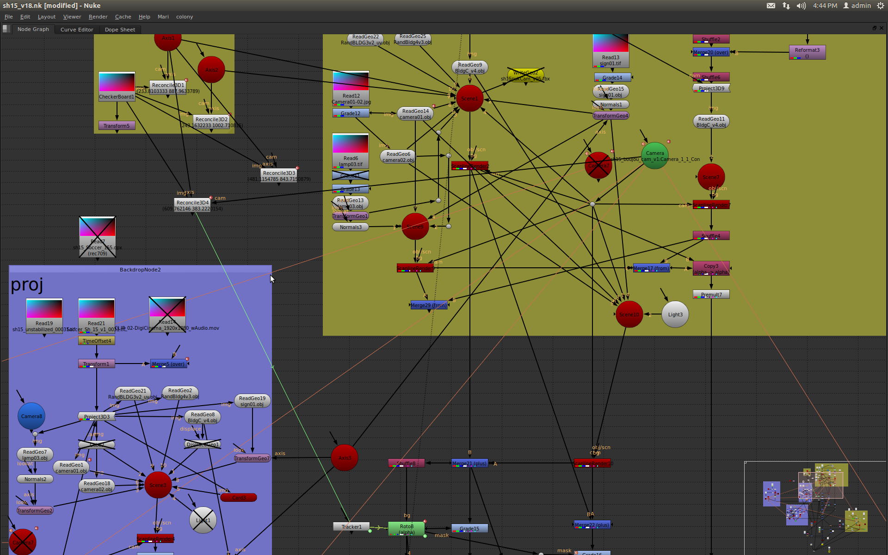

# Nuke-Compositing-Style-Guide

This style guide is an attempt to standardize compositing practices.

### "The Zen of Compositing"

>Explicit is better than implicit.  
Simple is better than complex.  
Complex is better than complicated.  
Flat is better than nested.  
Sparse is better than dense.  
Readability counts.  
There should be one-- and preferably only one --obvious way to do it.  
Now is better than never.  
Although never is often better than *right* now.  
If the implementation is hard to explain, it's a bad idea.  
If the implementation is easy to explain, it may be a good idea.  

